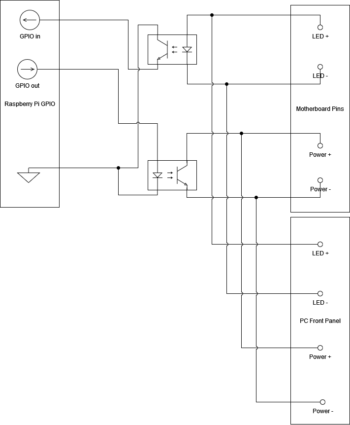

# PC-Bridge

Ein Programm, welches es ermöglicht den Status der Server-PC's einzusehen und diese remote starten zu können.


### Vorraussetzungen:
* Python3

starte setup.bat um eine lokale python enviroment zu erstellen und die nötigen libraries herunterzuladen.

Um den Server zu starten, führe start server aus. (die Website öffnet sicht bevor der Server hochgefahren ist. Einfach ein paar Sekunden warten und die Seite neu laden)


### default login:
Vor Inbetriebnahme ändern!!
Username: admin
Password: admin

### TODO:
* ~~Ermöglichen PC's in eine Datenbank Hinzuzufügen, Editieren, Löschen~~
* ~~Mit PC's kommunizieren~~
* ~~Status ermitteln und anzeigen~~
* ~~Mit CSS verschönern~~


### Raspi info:
IP: 192.168.100.119

Vor Inbetriebnahme ändern!!
username: pcbridge
password: pcbridge01

valid gpio slots: 5, 6, 12, 13, 16, 17, 18, 19, 20, 21, 22, 23, 24, 25, 26, 27


### API
check status: GET request to WEBSITE/pcmanager/getstatus with params id=1
restart: POST request to WEBSITE/pcmanager/restart with body(formdata) id: 1
shutdown: POST request to WEBSITE/pcmanager/shutdown with body(formdata) id: 1

### Raspi setup
* Task für Pc status Update anlegen: `crontab -e`
```
* * * * * python3 /path/to/pcbridge/folder/pc-bridge/PC_bridge/PCManager/gpio_reader.py
```

### PC start options

#### ~~wake on lan~~
##### Setup:
* erstelle /etc/systemd/network/50-wired.link
```
[Match]
MACAddress=aa:bb:cc:dd:ee:ff    # mac adresse des PC's

[Link]
NamePolicy=kernel database onboard slot path
MACAddressPolicy=persistent
WakeOnLan=magic
```
* stelle sicher, dass wake on lan im bios aktiviert ist
* installiere wakeonlan auf dem serverhost(raspberry pi)
* mit dem Befehl "wakeonlan aa:bb:cc:dd:ee:ff" kann nun der PC hochgefahren werden.

##### Einschränkungen:
* Pc muss Ordnungsgemäß heruntergefahren sein. Dass heißt nach einem Stromausfall oder Hard-Reset ist die Funktion nicht aktiv
* Man bekommt nicht zurück, ob es erfolgreich war oder nicht, das heißt man müsste Tests machen um sicherzugehen, dass der Pc hochgefahren ist.


### ~~PC shutdown/restart options~~

#### ~~ssh verbindung~~
##### ~~Setup:~~
* ~~ssh schlüssel auf server erstellen "ssh-keygen" (ggf mit passphrase)~~

### Mit powerbutton herunterfahren
Standartmäßig kann eine ubuntu Maschine per Powerbutton heruntergefafren werden. Aus irgendeinem Grund geht dies aber im headless Modus (ohne Monitor) nicht. Daher muss folgendes [Workaround](https://superuser.com/questions/1523918/run-script-when-power-button-pressed) angewendet werden:

Datei
`sudo nano /etc/acpi/events/power`
mit Inhalt 
```
event=button/power
action=shutdown -h now
```
erstellen, dann

`service acpid restart`




